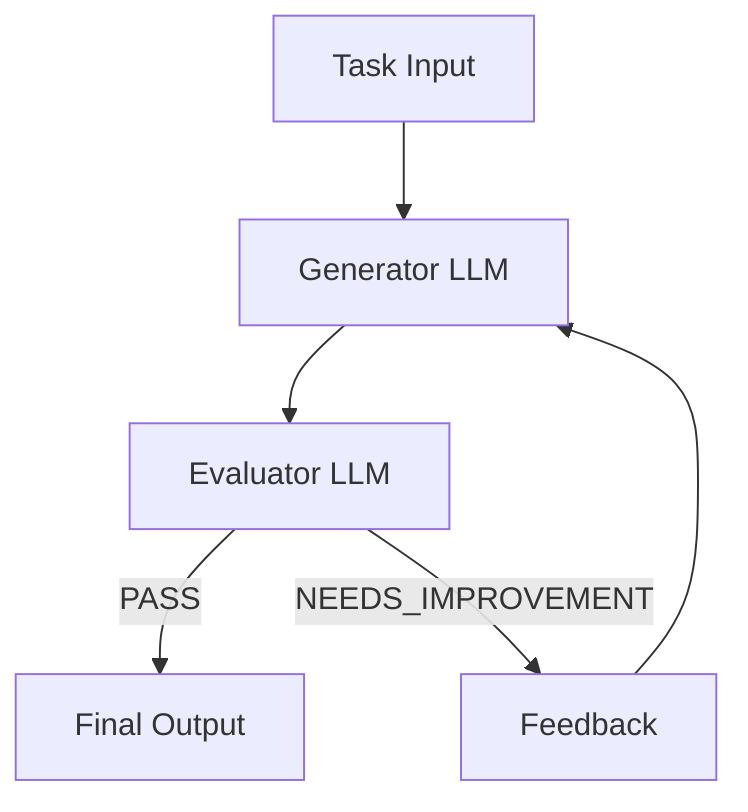

# Evaluator-Optimizer Pattern

此项目演示了用于构建有效的基于 LLM 的系统的 Evaluator-Optimizer 模式，如 [Anthropic 关于构建有效智能体的研究](https://www.anthropic.com/research/building-effective-agents) 中所述。


## 概述

Evaluator-Optimizer 模式实现了一个双 LLM 过程，其中一个模型生成响应，而另一个在迭代循环中提供评估和反馈，类似于人类作家的迭代改进过程。该模式由两个主要组件组成：

- **生成器 LLM**：生成初始响应并根据反馈进行改进
- **评估器 LLM**：分析响应并提供改进的详细反馈

## 工作原理

1. 生成器 LLM 为给定任务生成初始解决方案
2. 评估器 LLM 根据质量标准评估解决方案
3. 如果解决方案通过评估，则作为最终结果返回
4. 如果需要改进，将反馈纳入新的生成周期
5. 该过程重复，直到获得满意的解决方案



## 何时使用

此模式在以下情况下特别有效：

- 存在明确的评估标准来评估响应质量
- 迭代改进为输出提供可衡量的价值
- 任务受益于多轮批评和改进

### 示例应用

- 需要捕捉细微差别的文学翻译
- 需要多轮搜索和分析的复杂搜索任务
- 可以通过系统审查改进质量的代码生成
- 需要多份草稿和特定改进的内容创建

## 实现

该实现使用 Spring AI 的 ChatClient 进行 LLM 交互，包括：

```java
public class EvaluatorOptimizer {
    public RefinedResponse loop(String task) {
        // 1. 生成初始解决方案
        Generation generation = generate(task, context);

        // 2. 评估解决方案
        EvaluationResponse evaluation = evaluate(generation.response(), task);

        // 3. 如果 PASS，返回解决方案
        // 4. 如果 NEEDS_IMPROVEMENT，纳入反馈并生成新解决方案
        // 5. 重复，直到获得满意的解决方案
        return new RefinedResponse(finalSolution, chainOfThought);
    }
}
```

### 使用示例

```java
ChatClient chatClient = // ... 初始化聊天客户端
EvaluatorOptimizer agent = new EvaluatorOptimizer(chatClient);

// 处理一个任务
RefinedResponse response = agent.loop(
    "创建一个实现线程安全计数器的 Java 类"
);

// 访问结果
System.out.println("最终解决方案: " + response.solution());
System.out.println("演变过程: " + response.chainOfThought());
```

## 自定义

该模式可以通过以下方式进行自定义：

1. **自定义提示**：为生成器和评估器提供专门的提示
```java
agent = new EvaluatorOptimizer(
    chatClient,
    customGeneratorPrompt,
    customEvaluatorPrompt
);
```

2. **默认模板**：为常见用例修改默认提示
   - `DEFAULT_GENERATOR_PROMPT`：解决方案生成的模板
   - `DEFAULT_EVALUATOR_PROMPT`：解决方案评估的模板

## 响应格式

### 生成响应
```json
{
    "thoughts": "方法的简要描述",
    "response": "实际解决方案内容"
}
```

### 评估响应
```json
{
    "evaluation": "PASS|NEEDS_IMPROVEMENT|FAIL",
    "feedback": "改进的详细反馈"
}
```

## 依赖项

- Spring AI
- Spring Boot
- Java 17 或更高版本

## 参考

- [Building Effective Agents (Anthropic Research)](https://www.anthropic.com/research/building-effective-agents)
