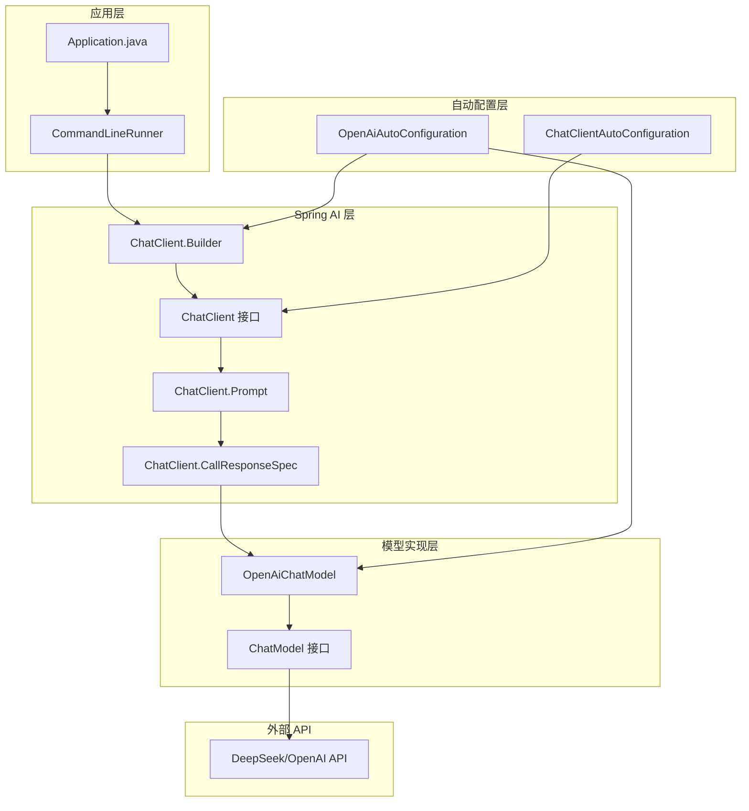
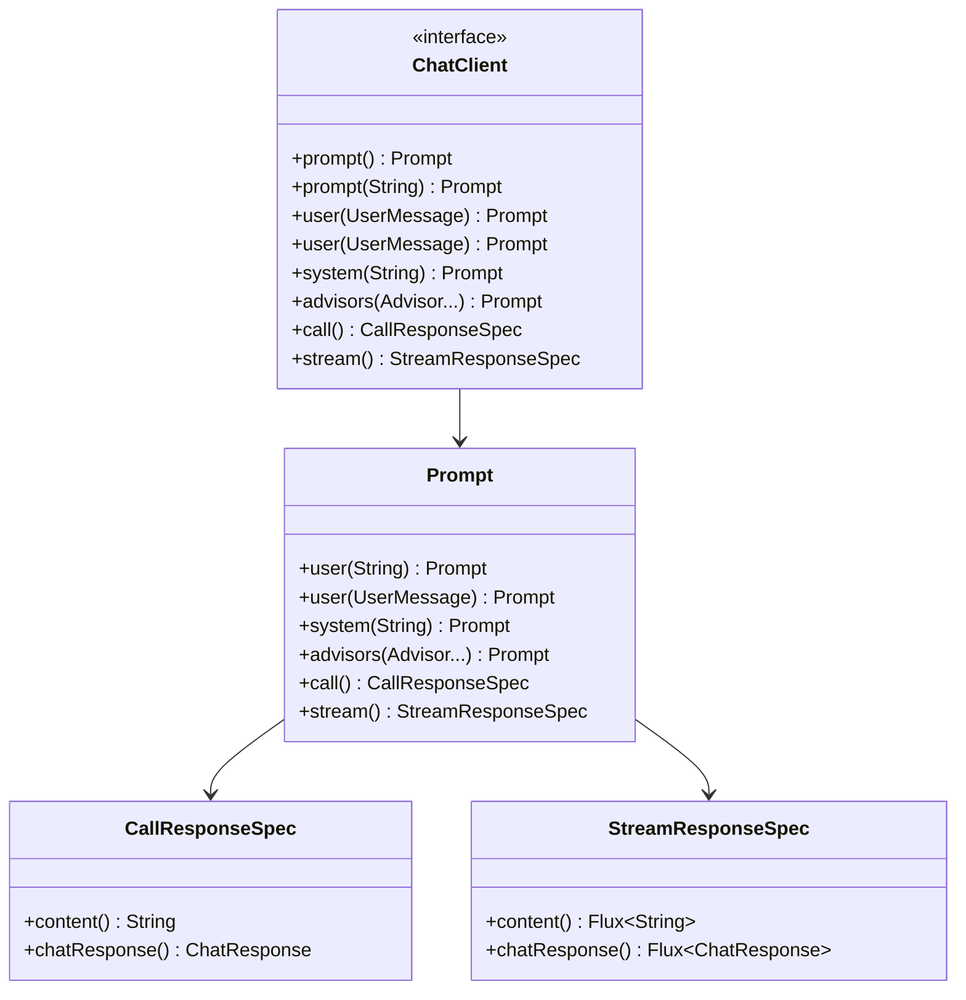
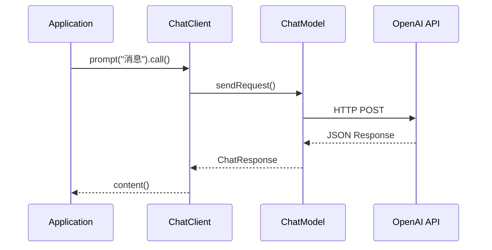
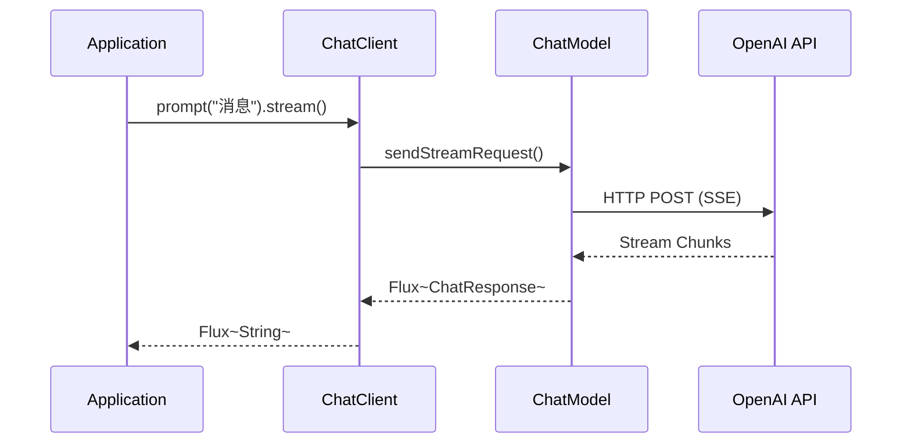
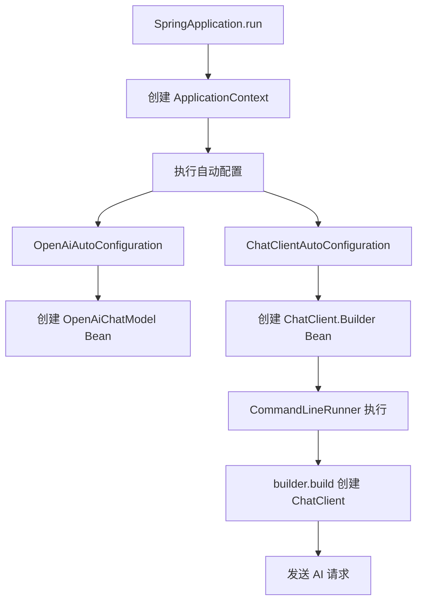
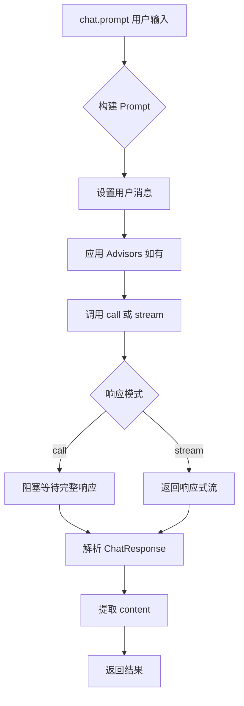
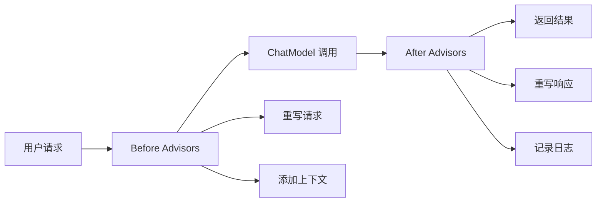

# Spring AI Hello World 聊天应用程序

一个简单的命令行聊天应用程序，演示 Spring AI 的 ChatClient 功能与 AI 模型。

## 前置条件

- Java 17 或更高版本
- Maven
- 此示例使用 OpenAI 作为模型提供商

在使用 AI 令牌之前，请确保您拥有来自 OpenAI 的开发者令牌。

在 [OpenAI 注册](https://platform.openai.com/signup) 创建账户，并在 [API 密钥](https://platform.openai.com/account/api-keys) 生成令牌。

Spring AI 项目定义了一个名为 `spring.ai.openai.api-key` 的配置属性，您应该将其设置为您从 OpenAI 获得的 API 密钥的值。

导出环境变量是设置该配置属性的一种方法：

```shell
export SPRING_AI_OPENAI_API_KEY=<在此处插入密钥>
```

## 运行应用程序

1. 克隆仓库
2. 导航到项目目录
3. 使用 Maven wrapper 运行应用程序：
   `./mvnw spring-boot:run`

## 示例交互

启动后，您将看到 Spring Boot banner，然后是：

```text
让我们聊天！
USER: 给我讲个笑话
ASSISTANT: 为什么骷髅不会互相打架？
它们没有胆量。
```

## 技术细节

### 架构文档

> **[详细架构文档 (Architecture Documentation)](docs/architecture.md)** - 查看 Spring AI ChatClient 的详细技术架构、实现原理和数据流程图

应用程序使用 Spring AI 的 ChatClient 与 AI 模型交互。以下演示代码展示了在 Spring Boot 应用程序中创建聊天交互的基本设置：

```java
@SpringBootApplication
public class Application {

    public static void main(String[] args) {
        SpringApplication.run(Application.class, args);
    }

    @Bean
    CommandLineRunner cli(ChatClient.Builder builder) {
        return args -> {
            var chat = builder.build();
            var scanner = new Scanner(System.in);
            System.out.println("\n让我们聊天！");
            while (true) {
                System.out.print("\nUSER: ");
                System.out.println("ASSISTANT: " +
                        chat.prompt(scanner.nextLine()).call().content());
            }
        };
    }
}
```

### 解释

1. **应用程序入口点：**

* `Application` 类使用 `@SpringBootApplication` 注解，标记它为 Spring Boot 应用程序的主入口点。
* `main` 方法通过调用 SpringApplication.run 启动应用程序。

2. **命令行运行器：**

* 定义了一个 `CommandLineRunner` bean 来在应用程序启动后启动聊天功能。
* 一个 `ChatClient.Builder` 用于创建 ChatClient 实例，它作为 AI 交互的核心接口。

3. **用户交互：**

* 使用 `Scanner` 捕获来自命令行的用户输入。
* 在连续循环中，应用程序从用户读取一行（`USER`）并将其作为提示发送给 `ChatClient`。
* 助手的响应使用 `chat.prompt(...).call().content()` 获取并显示为 `ASSISTANT'` 的回复。
* 这个简单的循环持续，直到用户终止应用程序。

---

## 架构文档

### 1. 概述

本文档详细介绍了 Spring AI ChatClient 的技术架构、实现原理和数据流程。ChatClient 是 Spring AI 框架的核心接口，用于与大语言模型（LLM）进行交互。

### 1.1 项目信息

| 属性 | 值 |
|------|-----|
| 模块名称 | ai-openai-helloworld |
| Spring AI 版本 | 2.0.0-SNAPSHOT |
| Spring Boot 版本 | 4.0.0 |
| Java 版本 | 17 |
| AI 模型提供商 | OpenAI（兼容 DeepSeek） |

### 1.2 核心功能

- 提供统一的 ChatClient 接口与 AI 模型交互
- 支持流式和阻塞式响应
- 自动装配 ChatClient.Builder
- 灵活的配置机制

### 2. 核心组件

#### 2.1 组件架构图



#### 2.2 核心类说明

| 类名 | 包路径 | 职责 |
|------|--------|------|
| `ChatClient` | `org.springframework.ai.chat.client` | 主接口，提供与 AI 模型交互的 API |
| `ChatClient.Builder` | `org.springframework.ai.chat.client` | 构建 ChatClient 实例的构建器 |
| `ChatModel` | `org.springframework.ai.chat.model` | 底层聊天模型抽象接口 |
| `OpenAiChatModel` | `org.springframework.ai.openai` | OpenAI API 的具体实现 |
| `OpenAiAutoConfiguration` | `org.springframework.ai.openai.autoconfigure` | OpenAI 相关 Bean 的自动配置 |

### 3. 实现原理

#### 3.1 ChatClient 接口设计

ChatClient 采用流式 API 设计，支持链式调用：



#### 3.2 响应模式

ChatClient 支持两种响应模式：

##### 3.2.1 阻塞式调用 (Call)



##### 3.2.2 流式调用 (Stream)



### 4. 数据链路

#### 4.1 完整数据流


#### 4.2 请求转换链

```
用户输入字符串
    ↓
UserMessage (Spring AI 消息抽象)
    ↓
Prompt (包含所有消息和配置)
    ↓
ChatRequest (OpenAI API 请求格式)
    ↓
HTTP JSON 请求体
    ↓
OpenAI/DeepSeek API
```

#### 4.3 响应转换链

```
API JSON 响应
    ↓
ChatResponse (Spring AI 响应抽象)
    ↓
Generation (生成结果集合)
    ↓
AssistantMessage (助手消息)
    ↓
content() (文本内容)
    ↓
用户看到的结果
```

### 5. 调用流程图

#### 5.1 应用启动流程



#### 5.2 请求处理流程



### 6. 配置机制

#### 6.1 自动配置原理

```mermaid
graph TB
    A[Spring.factories] --> B[OpenAiAutoConfiguration]
    A --> C[ChatClientAutoConfiguration]

    B --> D[@ConditionalOnClass]
    B --> E[@ConditionalOnMissingBean]
    B --> F[创建 OpenAiChatModel]

    C --> G[@ConditionalOnClass]
    C --> H[@ConditionalOnMissingBean]
    C --> I[创建 ChatClient.Builder]

    B --> J[创建 ChatModel]
    H --> K[注入 ChatModel]
```

#### 6.2 配置属性映射

| 配置属性 | 用途 | 默认值 |
|----------|------|--------|
| `spring.ai.openai.api-key` | API 密钥 | 从环境变量读取 |
| `spring.ai.openai.base-url` | API 基础 URL | `https://api.openai.com` |
| `spring.ai.openai.chat.options.model` | 使用的模型 | `gpt-4o` |
| `spring.ai.openai.chat.options.temperature` | 采样温度 | 0.7 |

#### 6.3 DeepSeek 兼容配置

本项目使用 DeepSeek API，配置如下：

```yaml
spring:
  ai:
    openai:
      api-key: ${DEEPSEEK_API_KEY}
      base-url: https://api.deepseek.com
      chat:
        options:
          model: deepseek-chat
```

### 7. 扩展点

#### 7.1 Advisor 机制

Advisor 允许在请求处理过程中注入自定义逻辑：



#### 7.2 可扩展的组件

| 扩展点 | 接口 | 用途 |
|--------|------|------|
| ChatModel | `ChatModel` | 支持不同的 AI 提供商 |
| Advisor | `CallAroundAdvisor` | 请求/响应拦截和处理 |
| Streaming | `StreamingChatModel` | 流式响应支持 |
| Memory | `ChatMemory` | 对话历史管理 |

#### 7.3 自定义模型实现

```java
// 实现 ChatModel 接口即可支持新的 AI 提供商
public class CustomChatModel implements ChatModel {
    @Override
    public ChatResponse call(Prompt prompt) {
        // 自定义实现
    }
}
```

### 8. 最佳实践

#### 8.1 错误处理

```java
try {
    String response = chat.prompt(userInput)
        .call()
        .content();
} catch (ApiException e) {
    // 处理 API 调用异常
    log.error("AI API 调用失败", e);
}
```

#### 8.2 资源管理

```java
// CommandLineRunner 中正确关闭上下文
@Bean
CommandLineRunner cli(ChatClient.Builder builder, ConfigurableApplicationContext context) {
    return args -> {
        // ... 业务逻辑
        context.close(); // 确保资源正确释放
    };
}
```

#### 8.3 配置安全

```yaml
# 不要硬编码 API Key
spring:
  ai:
    openai:
      api-key: ${OPENAI_API_KEY}  # 从环境变量读取
```

#### 8.4 性能优化建议

| 场景 | 建议 |
|------|------|
| 批量处理 | 使用流式 API 提高吞吐量 |
| 长对话 | 实现 ChatMemory 机制 |
| 高并发 | 配置连接池和超时参数 |
| 成本控制 | 设置合理的 maxTokens |

### 9. 参考资源

- [Spring AI 官方文档](https://docs.spring.io/spring-ai/reference/)
- [ChatClient API 文档](https://docs.spring.io/spring-ai/reference/api/chatclient.html)
- [OpenAI API 文档](https://platform.openai.com/docs/api-reference)
- [DeepSeek API 文档](https://platform.deepseek.com/api-docs/)
